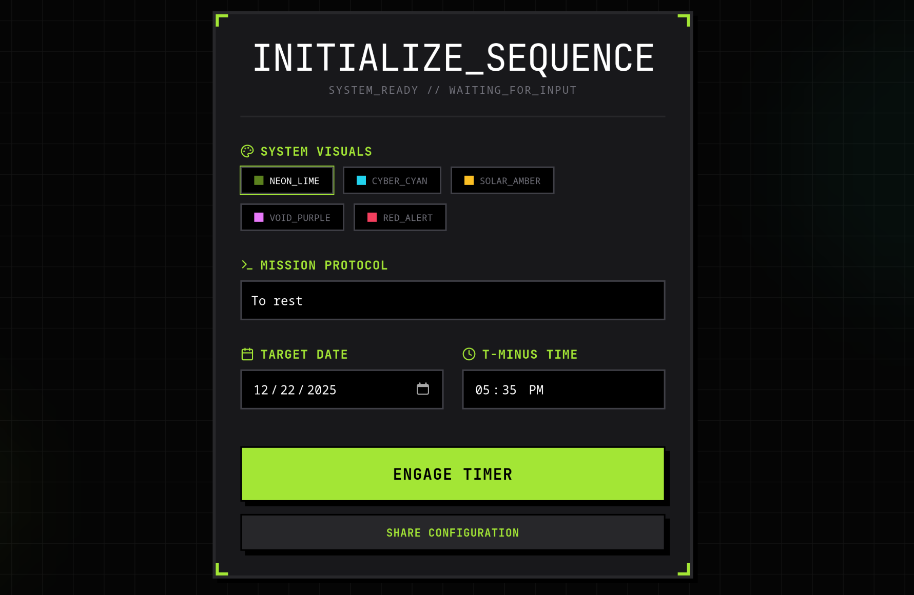
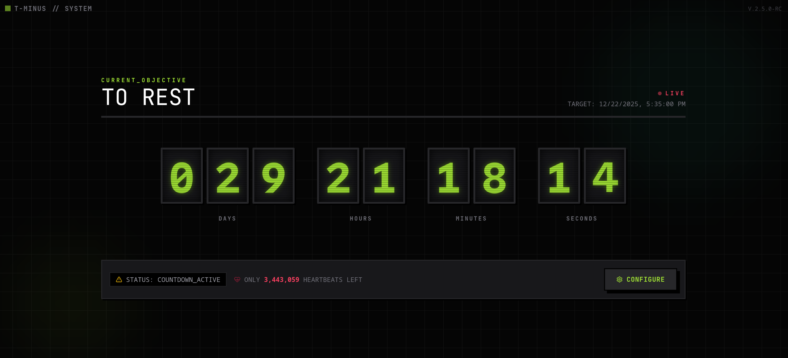

# `t-minus-protocol`

[](https://github.com/KnightChaser/t-minus-protocol/actions/workflows/deploy.yml)

You can try it right away with your browser at https://knightchaser.github.io/t-minus-protocol.

**T-MINUS PROTOCOL** is a highly stylized, cyberpunk-themed countdown timer designed for visual impact. Whether you are tracking a product launch, a hackathon deadline, or just the New Year, do it with a glitchy, neon-soaked aesthetic.


*Configure your "mission parameters" with multiple visual themes.*


*Monitor the countdown with smooth, odometer-style rolling digits.* OvO

## Features

- **Cyberpunk Aesthetic**: Immersive UI with glitch effects, neon glows, and CRT scanlines.
- **Customizable Themes**: Choose from 5 distinct color protocols: Neon Lime, Cyber Cyan, Solar Amber, Void Purple, and Red Alert.
- **Shareable Configurations**: Generate a unique URL to share your specific countdown configuration with others.

## Run Locally

**Prerequisites:**  Node.js

The procedure is very simple.

1. Install dependencies:
   ```bash
   npm install
   ```
2. Run the app:
   ```bash
   npm run dev
   ```

## Usage

1. **Initialize**: Enter a title for your protocol (event).
2. **Visuals**: Select a color theme that matches your mood.
3. **Target**: Set the date and time for the countdown.
4. **Engage**: Click "ENGAGE TIMER" to start.
5. **Share**: Use the "SHARE CONFIGURATION" button to copy a direct link to your countdown.

